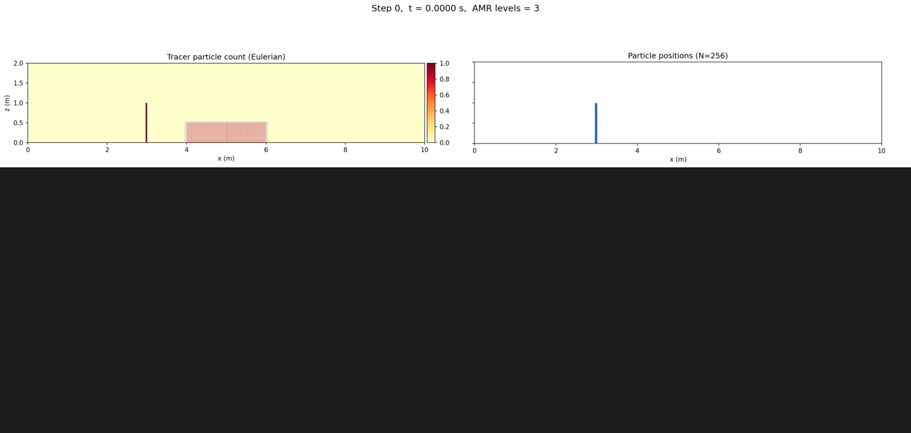
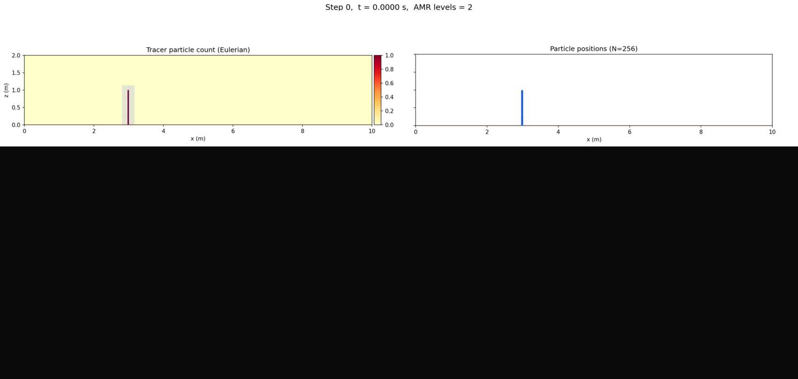

 .. role:: cpp(code)
    :language: c++

 .. _Particles:

Particles
=========

ERF has the option to include Lagrangian particles in addition to the mesh-based solution.
Currently there is one example of particle types available in ERF: tracer_particles.

The tracer particles are advected by the velocity field with optional sedimentation.

We note that unless the domain is periodic in the vertical direction, any particles that
cross the bottom boundary during the advection step will be moved back into the domain
at a location 1/5 of the way between the bottom boundary and the top of the cell at k = 0.

However, the AMReX particle data structure is very general and particles may take on a number of
different roles in future.

.. figure:: figures/ERFParticles.gif
   :alt: Particles in a squall line
   :align: center
   :width: 100%

   Two-dimensional squall line simulation with particles. The particles and contours of cloud water mixing ratio are shown.

Enabling Particles
------------------

To enable the use of particles, one must set

::

   USE_PARTICLES = TRUE

in the GNUmakefile if using gmake, or add

::

   -DERF_ENABLE_PARTICLES:BOOL=ON \

to the cmake command if using cmake.  (See, e.g., ``Build/cmake_with_particles.sh``)

One must also set

::

   erf.use_tracer_particles = 1

in the inputs file or on the command line at runtime.

Particle Precision
~~~~~~~~~~~~~~~~~~

Particle floating-point data (positions, velocities, and any user-defined
real-typed attributes) can be stored in single precision independently of
the mesh-data precision. With cmake, set

::

   -DERF_PARTICLES_PRECISION:STRING=SINGLE \

(default is ``DOUBLE``, which matches ``ERF_PRECISION``). This forwards to
``AMReX_PARTICLES_PRECISION`` and defines ``AMREX_SINGLE_PRECISION_PARTICLES``.
With gmake, set

::

   USE_SINGLE_PRECISION_PARTICLES = TRUE

in the GNUmakefile.

Initialization
--------------

Particles can be initialized in a box-shaped subregion of the domain by specifying

::

   tracer_particles.initial_distribution_type = box
   tracer_particles.particle_box_lo = 3.95 -1.0 -1.0
   tracer_particles.particle_box_hi = 4.00  2.0  3.0
   tracer_particles.place_randomly_in_cells = false

One particle is placed per cell that falls within the specified box.
If ``place_randomly_in_cells`` is true, the particle position within each cell
is randomized; otherwise it is placed at the cell center.

The time at which the particles are initialized can be controlled by

::

   tracer_particles.start_time = 0.5

Verbosity of particle operations can be controlled per species:

::

   tracer_particles.verbose = 1

Particles with AMR
-------------------

Tracer particles work with adaptive mesh refinement, including anisotropic
refinement ratios (e.g., ``amr.ref_ratio_vect = 2 1 2``) and terrain-following
coordinates. The particles are automatically redistributed across AMR levels
as they move through the domain.

With terrain-following (``StaticFittedMesh``) coordinates, the particle vertical
index is mapped between the physical z-coordinate and the terrain-conforming
mesh using the ``z_phys_nd`` field. This mapping is performed during particle
evolution and redistribution so that particles follow the physical coordinate
system rather than the index space.

The AMR level coupling type is controlled by

::

   erf.coupling_type = "TwoWay"

where ``TwoWay`` (default) enables refluxing and averaging down between coarse
and fine levels, and ``OneWay`` disables the fine-to-coarse feedback.
``OneWay`` is preferred for particle simulations as it avoids potential
instabilities at coarse-fine boundaries.

   Tracer particle advection over flat terrain with 2 AMR levels and static box
   tagging covering a partial z-extent (``inputs_over_flat_AMR2_box_partialz``).
   The refined region is fixed in space; particles enter and exit it as they advect.

   Tracer particle advection over flat terrain with 2 AMR levels and dynamic
   particle-count-based tagging (``inputs_over_flat_AMR2_particlecount``).
   The refined region tracks the particles as they move through the domain.

Particle-count-based refinement
^^^^^^^^^^^^^^^^^^^^^^^^^^^^^^^

Particles can drive dynamic AMR by tagging cells for refinement based on the
deposited particle count. This is configured through the standard refinement
indicator mechanism:

::

   erf.refinement_indicators = tracer_count_refine
   erf.tracer_count_refine.field_name = tracer_particles_count
   erf.tracer_count_refine.value_greater = 0.1
   erf.tracer_count_refine.max_level = 1
   erf.tracer_count_refine.start_time = 0.0

This refines cells where the deposited tracer particle count exceeds the
specified threshold. When using multiple AMR levels, the particle counts are
averaged down level-by-level (finest to coarsest) to ensure correct tagging
at all levels.

Output
------

The particle information is output when using the AMReX-native plotfile format, but not
when using netcdf.

To visualize the number of particles per cell as a mesh-based variable, add
``tracer_particles_count`` (if you have set ``erf.use_tracer_particles``)
to the line in the inputs file that begins

::

   erf.plot_vars_1 =

Example input files for particles with AMR can be found in
``Exec/RegTests/ParticleTests/``.

